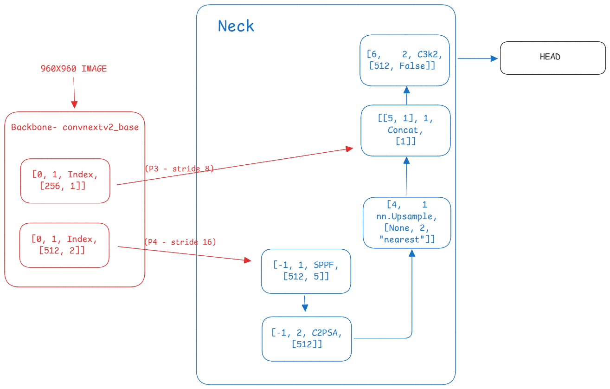
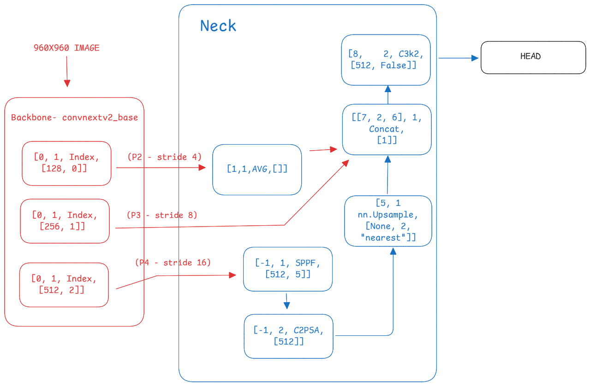

# BYU Bacterial Flagellar Motors Competition - 17th Place Solution

**Team:** Sergio Alvarez + Paradox (@sersasj, @iamparadox)  
**Final Ranking:** 17th Place  
**Competition:** BYU Bacterial Flagellar Motors Detection

## Table of Contents
- [Competition Context](#competition-context)
- [Solution Overview](#solution-overview)
- [Model Architectures](#model-architectures)
- [Installation & Setup](#installation--setup)
- [Training](#training)
- [Model Soup Technique](#model-soup-technique)
- [Results & Performance](#results--performance)
- [What Didn't Work](#what-didnt-work)

## Competition Context

### Business Context
The competition focused on detecting bacterial flagellar motors in cryo-electron tomography images. These molecular machines are crucial for bacterial motility and understanding their structure and location is important for biological research.

### Data Context
- **Training Data:** Cryo-electron tomography slice images with bounding box annotations
- **Target:** Detect and localize bacterial flagellar motors with high precision
- **Evaluation Metric:** Mean Average Precision (mAP)

## Solution Overview

Our approach evolved from initial U-Net experiments (scoring ~0.5) to YOLO-based detection models achieving 0.792+ on the public leaderboard. The key insight was leveraging the YOLO ultralytics framework with established augmentations, loss functions, and optimized detection heads while using Timm backbones.

### Key Components
- **Backbone:** ConvNeXtV2 Base with ImageNet-22k pretraining
- **Framework:** Modified YOLO11 with Timm integration
- **Feature Extraction:** Multi-scale features from P4, P3, and P2
- **Prediction Head:** Single detection head at P3 (stride/8)
- **Ensemble:** Three model configurations with model soup technique

## Model Architectures

We developed two main model configurations that differ only in neck design:

### Model 1 (CONFIG_1)
```
Backbone: convnextv2_base.fcmae_ft_in22k_in1k
Neck: SPPF + C2PSA → upsample P4 and concatenate with P3 → head
```
**Model 1**


### Model 2 (CONFIG_2) 
```
Backbone: convnextv2_base.fcmae_ft_in22k_in1k  
Neck: SPPF + C2PSA → upsample P4, adaptive_avg_pool2d at P2, concatenate P3 and upsampled P4 → head
```
**Model 2**



### Key Modifications
- **Removed P5 scale:** Improved scores by ~0.015 on public LB
- **Added AVG block:** Adaptive average pooling from mhaf-yolo paper
- **Single-scale prediction:** Focus on P3 level 

## Installation & Setup
# Download data 
https://www.kaggle.com/datasets/sersasj/training-dataset-byu-4

the data above is already ready to be ran. If you want to modify we have "download_external_data.py" file to download the external data and https://www.kaggle.com/competitions/byu-locating-bacterial-flagellar-motors-2025/data to download the hosts data. You can use prepare_dataset.py to tranform to yolo format 

### Prerequisites
```bash
# Clone the repository
git clone <repository-url>
cd byu-flagellar-motors-solution

# Install dependencies
pip install torch torchvision
pip install ultralytics
pip install timm
pip install albumentations
pip install pandas numpy matplotlib pyyaml
```

### Custom Ultralytics Setup
```bash
# The solution uses a custom ultralytics implementation with Timm integration
# Ensure the ultralytics-timm directory is in your project root
# Model configurations are located in: ultralytics-timm/ultralytics/cfg/models/11/yolo11-timm/
# a mode clean version can be found in the original fork: 
https://github.com/DoubleY-BEGC2024/ultralytics-timm/tree/main
https://github.com/ultralytics/ultralytics/pull/19609
```

### Directory Structure
```
project/
├── data/
│   ├── dataset.yaml
│   └── [training images and labels]
├── models/
├── runs/
├── ultralytics-timm/
├── training.py
├── soup.py
├── CONFIG_1_DRAW.png
├── CONFIG_2_DRAW.png
└── README.md
```

## Training

### Dataset Configuration
Create `data/dataset.yaml`:
```yaml
path: ./data
train: train/images
val: val/images
names:
  0: motor
```

### Training Configuration
The training uses 80% of images with motors (trust=4) plus 80% of external dataset (trust=0):

```python
python training.py
```

### Training Parameters
```python
epochs=45
batch=2
imgsz=960
optimizer='AdamW'
lr0=1e-4
lrf=0.1
dropout=0.1
mosaic=0.5
mixup=0.1
flipud=0.5
scale=0.25
degrees=45
label_smoothing=0.1
```

### Augmentation Strategy
Standard augmentations plus additional transformations for enhanced models:
- Blur and MedianBlur
- CLAHE and RandomBrightnessContrast
- GaussNoise and GaussianBlur
- ShiftScaleRotate
- ImageCompression
- UnsharpMask

## Model Soup Technique

To address epoch selection challenges and improve robustness, we implemented model soup averaging:

```python
python soup.py
```

This script:
1. Loads multiple epoch checkpoints from the same model
2. Averages their weights
3. Tests the soup model against individual models

### Benefits
- Improves generalization

## Results & Performance

### Final Ensemble
Our submission consisted of three components:
1. **Model 1** with standard training
2. **Model 1** with enhanced augmentations  
3. **Model 2** with standard training

### Performance Metrics
- **Best selected** 0.83487 final ensemble
- **Best non selected Private LB:** 0.85650 (best single model - Model 2 configuration)

### Inference Strategy
- **Concentration:** 0.5 (predict on half of available slices)
- **Clustering:** HDBSCAN with min_samples=1, cluster_size=4, EPS=50
- **YOLO Threshold:** 0.4
- **Confidence Adjustment:** Based on cluster size

### Key Findings
- **Model 2 performed best:** P2 features were crucial for performance
- **ConvNeXt Base optimal:** Larger models (ConvNeXt Large) performed worse

## What Didn't Work

### Alternative Approaches Tested
- **Alternative Backbones:** EfficientNetV2-L, ResNeXt50, CAFormer - all achieved ~0.8 but couldn't surpass ConvNeXt Base
- **Larger Models:** ConvNeXt Large performed worse than Base


### Validation Strategy Issues
- Poor correlation between CV and LB scores
- Difficulty in epoch selection
- mAP50, mAP50-95, precision, and recall curves weren't reliable predictors

## Running the Code

### Training a New Model
```bash
# Ensure dataset.yaml is properly configured
# Modify model configuration path in training.py if needed
python training.py
```

### Creating Model Soup
```bash
# Update model paths in soup.py to point to your trained models
# Adjust the list of epoch checkpoints as needed
python soup.py
```

### Key Files
- **training.py:** Main training script with all hyperparameters
- **soup.py:** Model soup implementation and testing
- **Model configs:** Located in `ultralytics-timm/ultralytics/cfg/models/11/yolo11-timm/`

